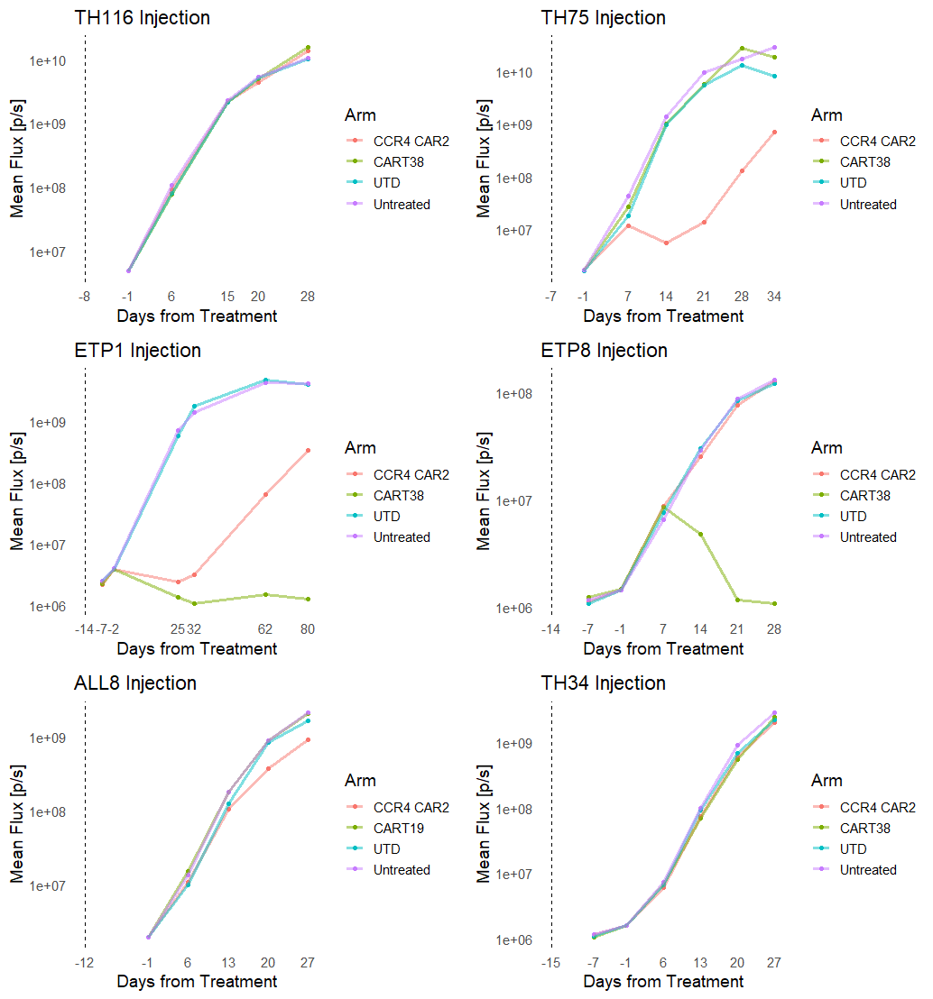
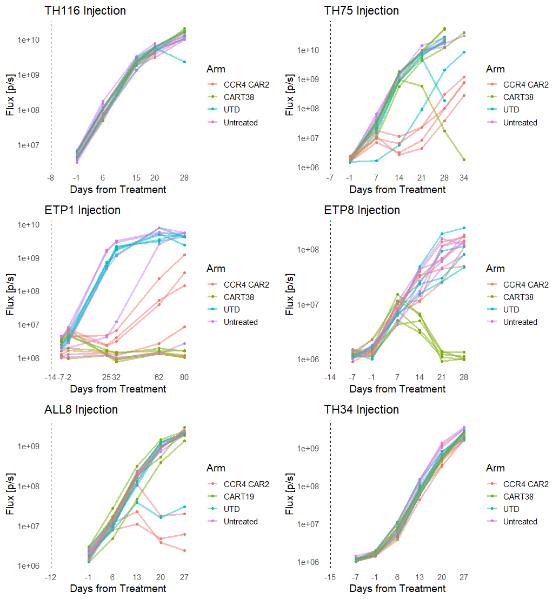

# Therapeutic Efficacy of CCR4 CART Treatment in NSG Mouse Models of T-ALL

## Summary

This is a dashboard for CCR4 CART experiments based off of this [template](https://github.com/mmccoy-01/bioluminsecent_imaging_experimental_template) I made for making reproducible, replicable, templateable, modular, and accurate experimental documentation for studies involving bioluminescent imaging.

My goal is to neatly package all experimental aspects together to provide an exhaustive yet succinctly navigable format.

## Abstract

Chimeric antigen receptor T-cell (CART) therapy is a type of adoptive cellular immunotherapy where a patient's own T-cells are genetically modified to express a chimeric antigen receptor on their surface. CART is designed to recognize a specific antigen present on cancer cells, including those in leukemias like Acute Lymphoblastic Leukemia (ALL). CART can directly recognize and target cancer cells that express the targeted antigen triggering an immune response that leads to the destruction of the cancer cells. CART therapies have shown remarkable efficacy in treating certain types of ALL. However, current treatments for children with T-cell ALL (T-ALL) are ineffective and present unique challenges. Compared to B-cell ALL, T-ALL has fewer targeted therapies available because T-ALL lacks highly specific surface antigens suitable for targeting with CART, which complicates the development of CART therapies for this disease subtype.

One potential target under investigation for CART therapy in T-ALL is C-C chemokine receptor type 4 (CCR4), a surface protein overexpressed on certain T-ALL cells and other hematological malignancies. Here we evaluated the preclinical efficacy and safety of CCR4 CART therapy compared to conventional CART38 treatment for T-ALL. Using patient-derived xenograft models of T-ALL, we assessed the impact of CCR4-targeted CART therapy on disease progression and overall burden. Our findings reveal a notable reduction in the development of select T-ALL subtypes characterized by CCR4 overexpression, suggesting the potential utility of this treatment approach in mitigating disease severity.

The successful translation of CART therapies to T-ALL necessitates careful consideration of target antigen selection to optimize therapeutic efficacy while minimizing off-target effects and associated toxicities. Current research efforts are focused on identifying suitable antigens uniquely expressed on T-ALL cells, such as CD7, CD5, and CD38, that exhibit minimal expression on normal T-cells, thereby reducing the risk of adverse effects. Nevertheless, the identification of ideal target antigens for CART therapy in T-ALL remains an active area of investigation, requiring comprehensive characterization and validation of candidate targets to maximize therapeutic benefit. Our study underscores the potential of CCR4-targeted CART therapy as a promising therapeutic approach for T-ALL, offering insights into its preclinical efficacy and safety profile. Furthermore, it highlights the ongoing challenges associated with suitable target antigen selection in CART therapy for T-ALL and emphasizes the need for continued research efforts to identify novel targets and optimize treatment strategies in pursuit of improved outcomes for patients with T-ALL.
