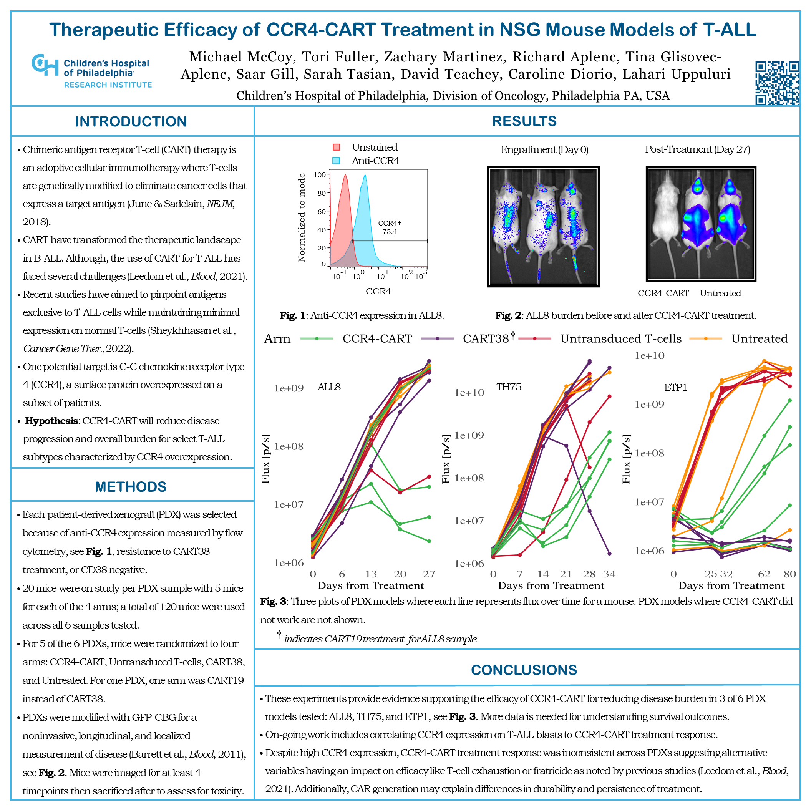

# Therapeutic Efficacy of CCR4-CART Treatment in NSG Mouse Models of T-ALL

## Abstract
Chimeric antigen receptor T-cell (CART) therapy is an adoptive cellular immunotherapy where T-cells are genetically modified to eliminate cancer cells that express a target antigen. Acute lymphobastic leukemia (ALL) has two types: B-cell ALL (B-ALL) and T-cell ALL (T-ALL). CART have shown remarkable efficacy in treating patients with B-ALL and have transformed the therapeutic landscape in B-ALL. The use of CART for T-ALL has lagged behind B-ALL because of several challenges: potential toxicity from elimination of normal T-cells, fratricide, difficulty separating blasts from normal T-cells during manufacturing, and the aggressive nature of relapsed T-ALL. One potential target is C-C chemokine receptor type 4 (CCR4), a surface protein that can be overexpressed in T-ALL. We performed a screen for CCR4 expression in a cohort of patient samples, finding expression on more than 70% of T-ALL samples examined. Based on high-expression in many patients with T-ALL, we developed and evaluated the preclinical efficacy and safety of CCR4-CART generated via CD3/CD28 co-stimulation with 28z signaling domain.

Using patient-derived xenograft (PDX) models of T-ALL, we assessed the impact of CCR4-targeted CART therapy on disease progression and overall burden in NSG mice. We tested the efficacy of CCR4-CART in PDX models developed from 6 different patients. Patient blasts were modified with GFP and CBG for bioluminescent tracking of disease in vivo with published techniques (PMID: 21856863). For 5 of the 6 PDX samples, mice were randomized to four arms after T-ALL engraftment defined as 1e6 photons per second: CCR4-CART, untransduced T-cells, CART38, and untreated. For one sample, one arm was CART19 instead of CART38. 20 mice were on study per sample with 5 mice per arm for 4 arms; a total of 120 mice were used across studies. After randomization, mice were imaged weekly for 4 weeks to track T-ALL development and treatment efficacy and mice were sacrificed afterwards to assess for toxicity either at study termination or once a humane endpoint had been reached.

We found CCR4-CART treatment was effective in 3 of 6 PDX models. In contrast, CART38 was effective in 2 of 5 PDX models. Compared to mice treated with untransduced T-cells, there was a statistically significant decrease in disease burden in these 3 PDX models. Efficacy of CCR4-CART was comparable to CART38 in these samples. No gross toxicities were found on necropsy and detailed histopathology is on-going. Our study underscores the potential of CCR4-targeted CART therapy as a promising therapeutic approach for T-ALL. On-going work includes comparing response to CCR4-CART with CCR4 expression on T-ALL blasts, testing efficacy and toxicity in additional patient samples, and mechanistic studies investigating the biologic role of CCR4 in T-ALL. A clinical trial for children and young adults with relapsed and refractory T-ALL and T-cell lymphoblastic lymphoma is in development.

### Key words:
T-cell acute lymphoblastic leukemia (T-ALL), chimeric antigen receptor T-cell (CART) therapy, C-C chemokine receptor type 4 (CCR4), patient-derived xenograft (PDX), bioluminescent imaging (BLI)

---

## References for poster
Barrett, D. M., Seif, A. E., Carpenito, C., Teachey, D. T., Fish, J. D., June, C. H., Grupp, S. A., & Reid, G. S. D. (2011). Noninvasive bioluminescent imaging of primary patient acute lymphoblastic leukemia: A strategy for preclinical modeling. *Blood*, *118*(15). https://doi.org/10.1182/blood-2011-04-346528

June, C. H., Sadelain, M. (2018). Chimeric Antigen Receptor Therapy. *The New England Journal of Medicine*, *379*(1), 64–73. https://doi.org/10.1056/nejmra1706169

Leedom, T., Hamil, A. S., Pouyanfard, S., Govero, J., Langland, R., Ballard, A., Schwarzkopf, L., Martens, A., Espenschied, A., Vinay, P., James, M., Mahajan, N., Spencer, D. H., Chrobak, K. M., Cooper, M. L., & Kabakibi, A. (2021). Characterization of WU-CART-007, an Allogeneic CD7-Targeted CAR-T Cell Therapy for T-Cell Malignancies. *Blood*, *138*(Supplement 1), 2772–2772. https://doi.org/10.1182/blood-2021-153150

Sheykhhasan, M., Manoochehri, H., & Dama, P. (2022). Use of CAR T-cell for acute lymphoblastic leukemia (ALL) treatment: a review study. *Cancer gene therapy*, *29*(8-9), 1080–1096. https://doi.org/10.1038/s41417-021-00418-1

---

---

The code used to put this poster together is based off of this [template](https://github.com/mmccoy-01/bioluminsecent_imaging_experimental_template) that I made for reproducible, replicable, templateable, modular, and accurate experimental documentation for studies involving bioluminescent imaging. My goal is to neatly package all experimental aspects together to provide an exhaustive yet succinctly navigable format.

[![CC BY-NC-SA 4.0][cc-by-nc-sa-shield]][cc-by-nc-sa]

This work is licensed under a
[Creative Commons Attribution-NonCommercial-ShareAlike 4.0 International License][cc-by-nc-sa].

[![CC BY-NC-SA 4.0][cc-by-nc-sa-image]][cc-by-nc-sa]

[cc-by-nc-sa]: http://creativecommons.org/licenses/by-nc-sa/4.0/
[cc-by-nc-sa-image]: https://licensebuttons.net/l/by-nc-sa/4.0/88x31.png
[cc-by-nc-sa-shield]: https://img.shields.io/badge/License-CC%20BY--NC--SA%204.0-lightgrey.svg
